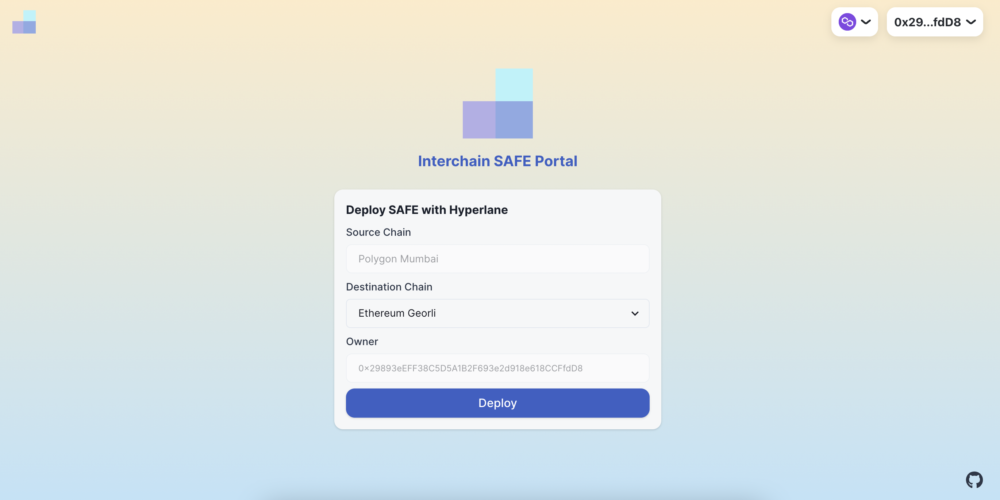
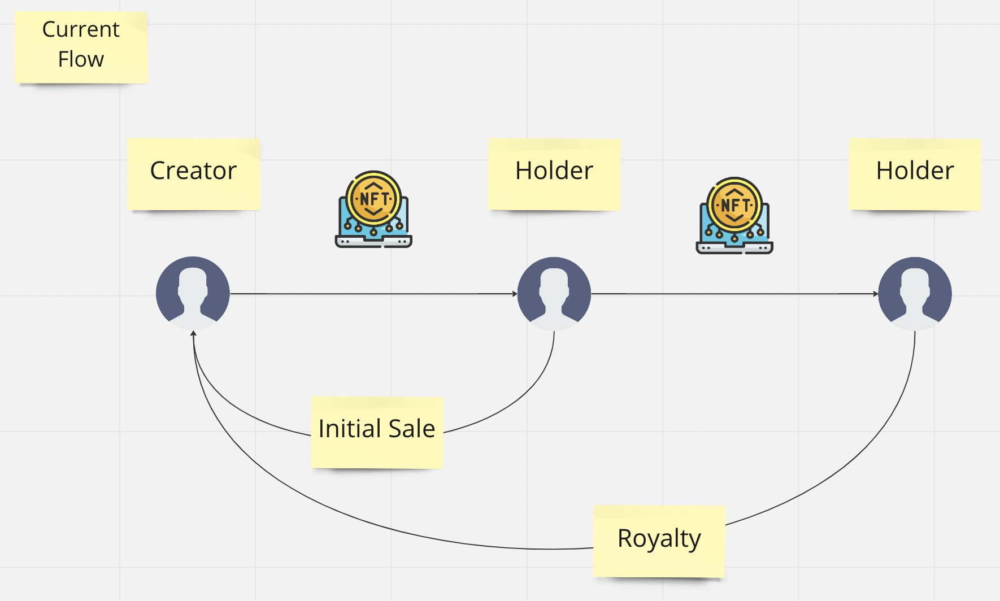
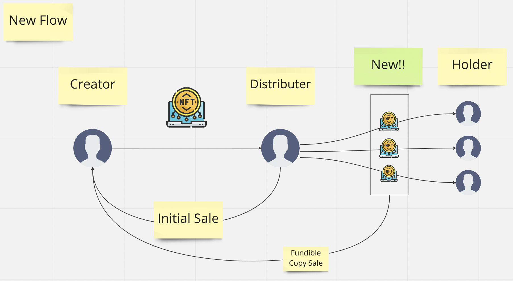
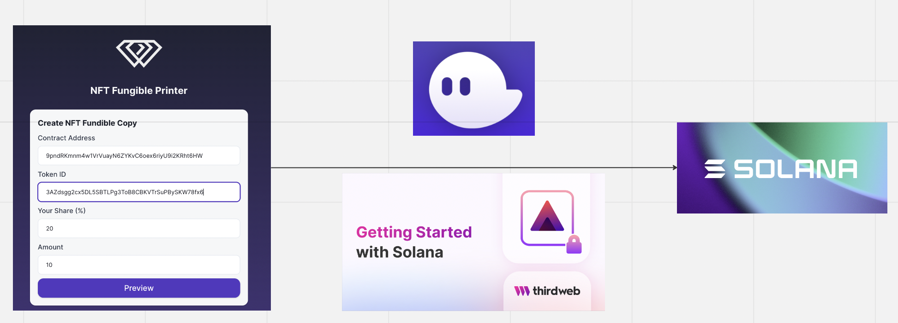

# NFT Fungible Printer

NFT royalty with the new distribution model.

## Overview

NFT holders can create fungible copies against the original NFT.
And the copied NFT inherits the original NFT's royalty and creator info. With NFT Fungible Printer, The holder can be a distributor of the NFTs, and it brings a new creator & ownership economy to the NFT space.

## Submission

### Live App

https://nft-fungible-printer.vercel.app/

### Pitch Deck

https://docs.google.com/presentation/d/1fP4A2n3ud6s2DQ3XtVjEMWX7BTJO2C4iI9-WKBFFeB0/edit?usp=sharing

### Demo

https://youtu.be/xWX1al915aw

## Overview

### Current Flow

- A creator can make money from an initial sale
- If the creator wants to have long tail revenue, it is required to let holders sell NFTs to the other holders with a higher price
- This is a limitation of the current NFT distribution flow

### New Flow with NFT Fungible Printer

- The holder can make fungible copies of the NFT
- The fungible copies inherit the original NFT's creator and royalty information
- The holder can be a distributor of the NFTs, and it brings new creator & ownership economy

## How it works

### Thirdweb

We are using Thirdweb Solana SDK for rapid development

### Architecture

### Diagram

- Users inputs original NFT information
- Check the preview of the fungible copy
- Send tx and copy NFT is displayed in Thirdweb dashboard with inherited creator & royalty information
