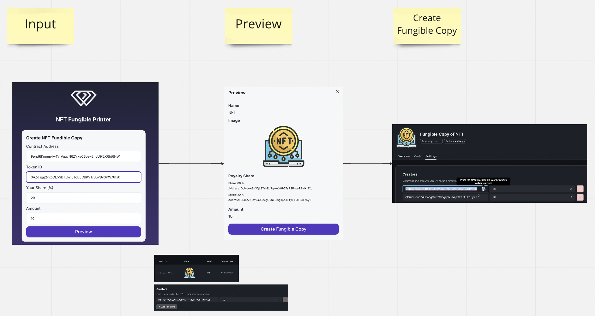

# NFT Fungible Printer

NFT holders can create an NFT drop against the original NFT.
The copied NFT drop royalty is back to the original ERC721 NFT creator.

## Submission

### Live App

TBD

### Pitch Deck

TBD

### Demo

TBD

## Overview

### Current Flow

- A creator can make money from an initial sale
- If the creator wants to have long tail revenue, it is required to let holders sell NFTs to the other holders with a higher price
- This is a limitation of the current NFT distribution flow

### New Flow with NFT Fungible Printer

- The holder can make fungible copies of the NFT
- The fungible copies inherit the original NFT's creator and royalty information
- The holder can be a distributor of the NFTs, and it brings new creator & ownership economy

## How it works

### Thirdweb

We are using Thirdweb Solana SDK for rapid development

### Diagram

- Users inputs original NFT information
- Check the preview of the fungible copy
- Send tx and copy NFT is displayed in Thirdweb dashboard with inherited creator & royalty information
