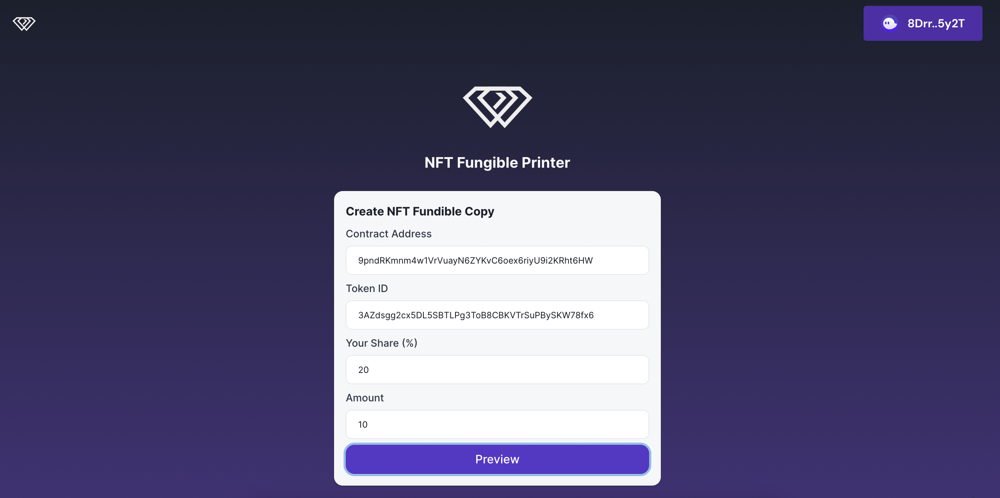

# Interchain Safe Portal

a One-stop SAFE deployment portal with Hyperlane

## Submission

### Live App

https://interchain-safe-portal.vercel.app/

### Pitch Deck

https://docs.google.com/presentation/d/168juHv1bIAsz5gmniO9YCZgkpLX7ZKSwFyMM62HlKFE/edit?usp=sharing

### Demo

TBD

## Overview

Interchain SAFE Portal is a one-stop SAFE deployment portal built with Hyperlane

Users can choose a destination chain and make SAFE deployment tx from any chain which is supported by Hyperlane

Deployed SAFE can be imported to the SAFE app.

## How it works

